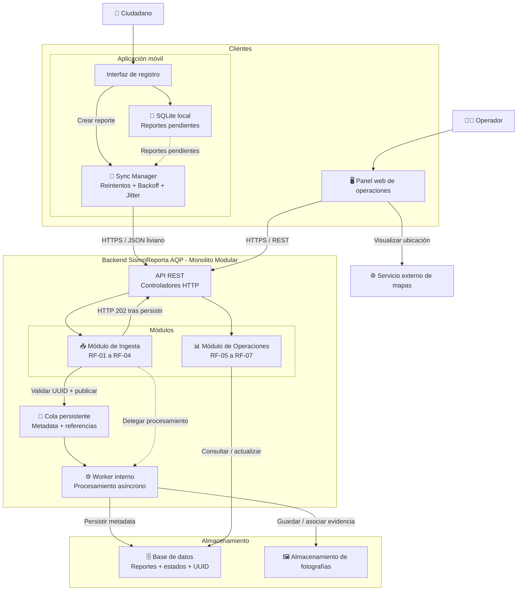

# Laboratorio 04: Arquitectura de Software – SismoReporta AQP

> **Universidad Nacional de San Agustín de Arequipa (UNSA)**  
> **Facultad de Ingeniería de Producción y Servicios — Escuela Profesional de Ingeniería de Sistemas**  
> **Curso:** Fundamentos de Arquitectura de Software (2026-B)  
> **Repositorio:** `cs-2026b-lab04-SismoReportaAQP-`

---

## 1. Información del Proyecto y Caso Asignado

* **Caso seleccionado:** **Caso 8 — SismoReporta AQP**
* **Contexto:** Plataforma ciudadana para el reporte ágil de daños en infraestructura tras un evento sísmico en la región Arequipa, orientada a brindar soporte táctico y priorización de zonas a brigadistas y personal de Defensa Civil.
* **Actores clave:**
  * **Ciudadano:** Registra reportes con coordenadas geográficas y evidencia fotográfica, incluso sin conectividad móvil inmediata.
  * **Operador / Coordinador de Defensa Civil:** Visualiza el mapa de calor/daños, filtra y clasifica incidentes, actualiza estados y asigna cuadrillas.
  * **Brigadista:** Recibe asignación de incidentes priorizados para atención en terreno.
* **Atributo de calidad crítico:** **Disponibilidad y Resiliencia ante picos extremos:** Capacidad de tolerar una ráfaga de hasta **20 000 reportes en la primera hora** posterior al sismo con la red celular congestionada, garantizando un enfoque *Offline-First* donde la app móvil almacena localmente y sincroniza de forma segura al restablecerse la señal.

---

## 2. Integrantes del Equipo y Roles

| Integrante | Correo Institucional | Rol Principal | Responsabilidades |
|---|---|---|---|
| **Josue Quispe Paucar** | `jquispepauc@unsa.edu.pe` | Arquitecto de Software | Definición de drivers (E1), matriz de decisión multicriterio (E2) y registros de decisiones ADR (E4). |
| **Gonzalo Cárdenas** | `gcardenas@unsa.edu.pe` | Ingeniero de Infraestructura y Despliegue | Modelado de diagramas Mermaid (E3), alternativa PlantUML (E5) y automatización de despliegue en Google Colab (E6). |
| **Colaborador / Auditor** | `grupo@unsa.edu.pe` | Analista de Calidad y Auditoría IA | Auditoría adversarial de IA (E7), redacción del informe técnico y revisión cruzada de PRs (E8). |

---

## 3. Diagrama de Arquitectura de la Solución Elegida (Mermaid)

La arquitectura adoptada corresponde a un **Monolito Modular con Ingesta Asíncrona Simplificada**, la cual desacopla la recepción inmediata de reportes de su procesamiento pesado y persistencia en base de datos.



---

## 4. Índice de Entregables del Laboratorio

| Entregable | Descripción | Enlace al Archivo | Artefactos Visuales |
|---|---|---|---|
| **E1** | Drivers arquitectónicos, atributos de calidad y escenarios en 6 partes | [`docs/architecture/drivers.md`](file:///home/gocardi/Unsa/cs/cs-2026b-lab04-SismoReportaAQP-/docs/architecture/drivers.md) | — |
| **E2** | Matriz de decisión ponderada multicriterio y auditoría de IA | [`docs/architecture/matriz-decision.md`](file:///home/gocardi/Unsa/cs/cs-2026b-lab04-SismoReportaAQP-/docs/architecture/matriz-decision.md) | A1 (4.40), A2 (3.90), A3 (3.35) |
| **E3** | Diagrama de arquitectura como código en Mermaid | [`docs/architecture/diagramas/arquitectura.mmd`](file:///home/gocardi/Unsa/cs/cs-2026b-lab04-SismoReportaAQP-/docs/architecture/diagramas/arquitectura.mmd) | [`Diagrama de Arquitectura.png`](file:///home/gocardi/Unsa/cs/cs-2026b-lab04-SismoReportaAQP-/docs/architecture/diagramas/img/Diagrama%20de%20Arquitectura.png) |
| **E4** | Registros de Decisiones Arquitectónicas (ADRs) | [`docs/architecture/adr/`](file:///home/gocardi/Unsa/cs/cs-2026b-lab04-SismoReportaAQP-/docs/architecture/adr/) | [ADR-001](file:///home/gocardi/Unsa/cs/cs-2026b-lab04-SismoReportaAQP-/docs/architecture/adr/001-estilo-arquitectonico.md), [ADR-002](file:///home/gocardi/Unsa/cs/cs-2026b-lab04-SismoReportaAQP-/docs/architecture/adr/002-sincronizacion-offline.md), [ADR-003](file:///home/gocardi/Unsa/cs/cs-2026b-lab04-SismoReportaAQP-/docs/architecture/adr/003-cola-procesamiento-asincrono.md) |
| **E5** | Diagrama de la alternativa descartada (PlantUML) | [`docs/architecture/diagramas/alternativa.puml`](file:///home/gocardi/Unsa/cs/cs-2026b-lab04-SismoReportaAQP-/docs/architecture/diagramas/alternativa.puml) | [`AlternativaPlantUML.png`](file:///home/gocardi/Unsa/cs/cs-2026b-lab04-SismoReportaAQP-/docs/architecture/diagramas/img/AlternativaPlantUML.png) |
| **E6** | Vista de despliegue físico y lógico (Python Diagrams / Colab / PlantUML) | [`despliegue.py`](file:///home/gocardi/Unsa/cs/cs-2026b-lab04-SismoReportaAQP-/docs/architecture/diagramas/despliegue.py) · [`despliegue_colab.ipynb`](file:///home/gocardi/Unsa/cs/cs-2026b-lab04-SismoReportaAQP-/docs/architecture/diagramas/despliegue_colab.ipynb) · [`despliegue.puml`](file:///home/gocardi/Unsa/cs/cs-2026b-lab04-SismoReportaAQP-/docs/architecture/diagramas/despliegue.puml) | [`despliegue.png`](file:///home/gocardi/Unsa/cs/cs-2026b-lab04-SismoReportaAQP-/docs/architecture/diagramas/img/despliegue.png) |
| **E7** | Bitácora de interacciones con IA (5 sesiones, correcciones y prompts) | [`docs/architecture/bitacora-ia.md`](file:///home/gocardi/Unsa/cs/cs-2026b-lab04-SismoReportaAQP-/docs/architecture/bitacora-ia.md) | Auditoría de 6 sesgos e IA adversarial |
| **E8** | README del repositorio y síntesis técnica grupal | [`README.md`](file:///home/gocardi/Unsa/cs/cs-2026b-lab04-SismoReportaAQP-/README.md) | Este documento |

---

## 5. Reflexión Grupal sobre el Aporte y Límites de la Inteligencia Artificial

Durante el desarrollo de este laboratorio, la Inteligencia Artificial demostró ser un catalizador valioso para explorar rápidamente alternativas de diseño, estructurar especificaciones técnicas y generar bocetos iniciales de diagramas como código. No obstante, comprobamos que la IA tiende recurrentemente a la sobreingeniería (como proponer clústeres de Kubernetes y Apache Kafka para cargas de 5.5 req/s) y a formular afirmaciones hiperbólicas no fundamentadas, tales como "escalabilidad infinita" o "garantía absoluta de cero fallos". La aplicación rigurosa de la regla de oro (*la IA propone, el equipo decide y verifica*) resultó imprescindible: contrastar cada recomendación contra las restricciones reales de un MVP a 1 mes y un equipo de 3 desarrolladores permitió depurar sesgos, rechazar servicios innecesarios y consolidar una arquitectura pragmática, eficiente y viable.

---

## 6. Instrucciones de Reproducción de los Diagramas

### A. Vista de Despliegue en Python (`despliegue.py`)
Para generar la imagen del diagrama de despliegue mediante la librería `diagrams` de Python:

#### Opción 1: En Google Colab (Recomendado)
1. Abrir el notebook [`docs/architecture/diagramas/despliegue_colab.ipynb`](file:///home/gocardi/Unsa/cs/cs-2026b-lab04-SismoReportaAQP-/docs/architecture/diagramas/despliegue_colab.ipynb) en Google Colab.
2. Ejecutar la celda de instalación de Graphviz y dependencias:
   ```bash
   !apt-get update -qq && !apt-get install -y -qq graphviz
   !pip install -q diagrams
   ```
3. Ejecutar el script y visualizar el resultado generado en `img/despliegue.png`.

#### Opción 2: Entorno Local con Linux
Asegurarse de contar con Graphviz y Python 3 en el sistema:
```bash
# Ubuntu/Debian:
sudo apt-get install -y graphviz
pip install diagrams

# Ejecutar el script:
python docs/architecture/diagramas/despliegue.py
```

### B. Vista de Despliegue Alternativa en PlantUML
En caso de restricciones de entorno local, se encuentra disponible [`docs/architecture/diagramas/despliegue.puml`](file:///home/gocardi/Unsa/cs/cs-2026b-lab04-SismoReportaAQP-/docs/architecture/diagramas/despliegue.puml), el cual puede visualizarse y compilarse directamente en [PlantUML Web Server](http://www.plantuml.com/plantuml) o mediante la extensión de PlantUML en VS Code / Antigravity IDE.
